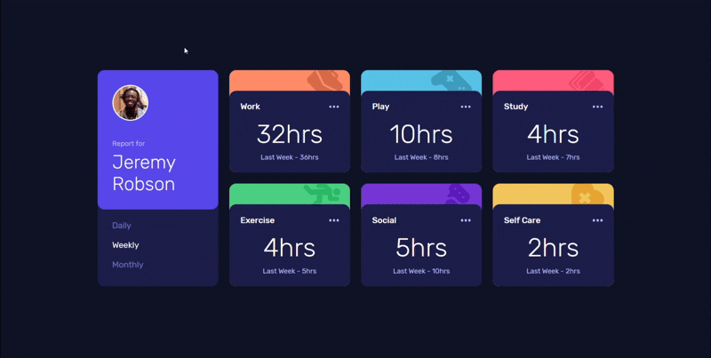
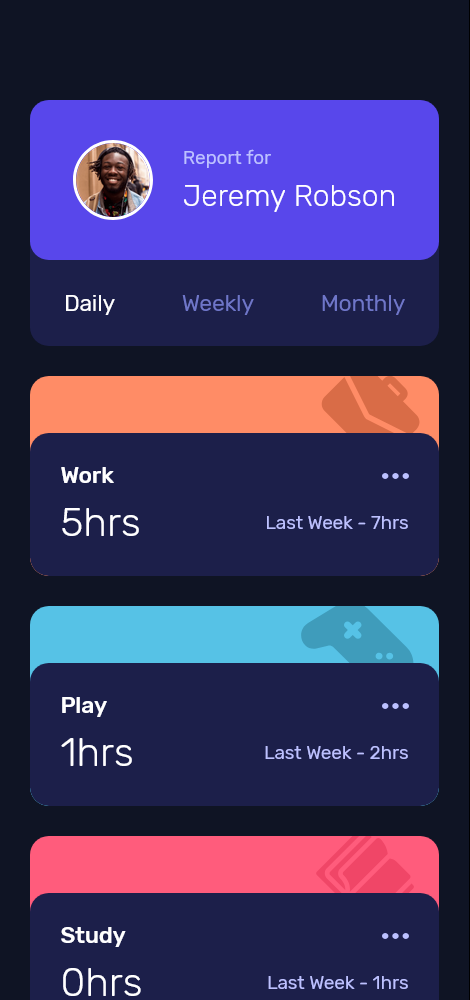
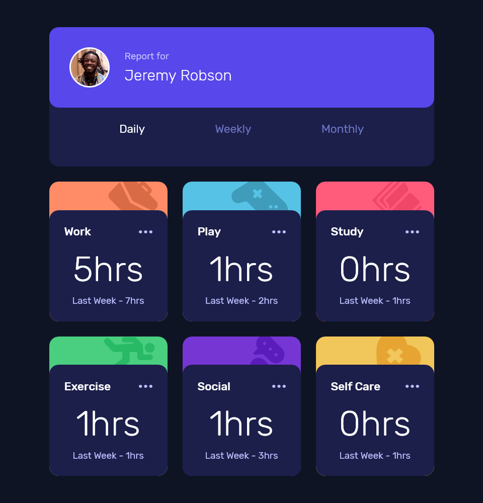
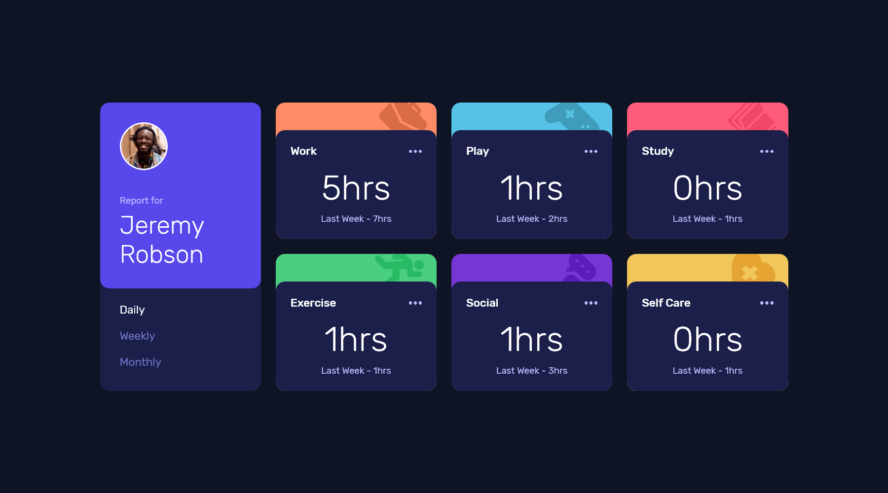
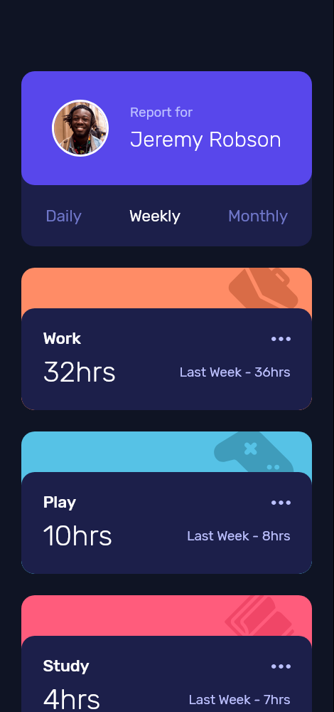
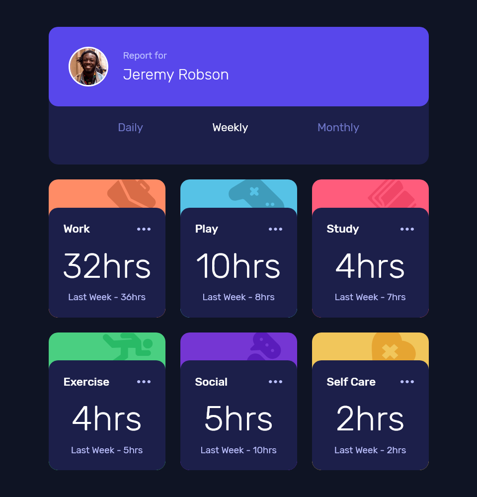
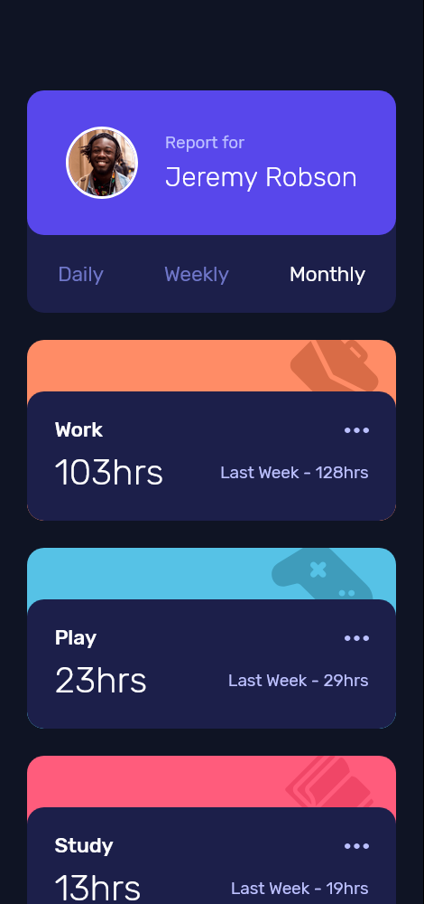
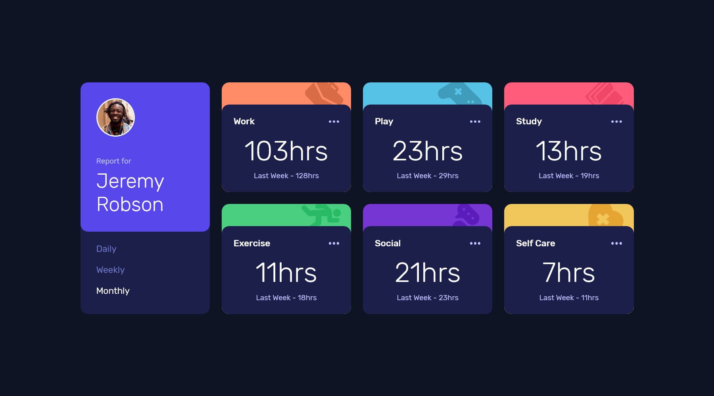

# ⏱️ Time Tracking Dashboard

A responsive dashboard layout featuring interactive timeframe toggles 🖱️, seamless CSS transitions ✨, and dynamic data fetching from a local JSON file 🗂️.

## 📝 Overview

This project was developed as a high-fidelity implementation of a Figma design 🎨 focusing on creating a seamless and fully responsive layout across mobile 📱, tablet 📲, and desktop 💻 environments.

Key focus areas included building a CSS Grid architecture 🏗️ to manage layout shifts, implementing adaptive styles using a mobile-first approach 📏, and employing JavaScript Fetch API ⚡ to dynamically populate UI components with data from a local JSON file 📄.

## 🔗 Live Demo

## 🎨 Visual Design

| State 🎛️ | Mobile 📱 | Tablet 📲 | Desktop 💻 |
| :--- | :--- | :--- | :--- |
| **☀️ Daily** |  |  |  |
| **🗓️ Weekly** |  |  |  |
| **🌙 Monthly** |  |  |  |

## 🎯 The Challenge

The challenge was to build out this **dashboard** 📊 and get it looking as close to the design as possible.

### 🧑‍💻 Users should be able to:

- 🔄 Switch between viewing **Daily**, **Weekly**, and **Monthly** stats.

- 📱 View the optimal layout for the interface depending on their device's screen size.

- 🖱️ See hover and focus states for all interactive elements on the page.

## 🛠️ Built with

## 🚀 Features

- ⚡ **Dynamic Data Rendering:** Utilizes the Fetch API to seamlessly inject statistics from a local JSON file directly into the DOM.

- ⏱️ **Interactive Timeframes:** Users can toggle between **Daily**, **Weekly**, and **Monthly** views with instantly updating data and UI states.

- 📐 **Responsive Architecture:** Employs CSS Grid and media queries to create a fluid layout that adapts perfectly to mobile, tablet, and desktop screens.

- ✨ **Polished User Experience:** Features smooth CSS background transitions on hover and distinct active states for navigation buttons.

## 👤 Author

**Christian Diaz**

- 💼 LinkedIn - [Christian Diaz](https://www.linkedin.com/in/chris-diazasc/)
- 👾 Frontend Mentor - [@chrisdzasc](https://www.frontendmentor.io/profile/chrisdzasc)
- 🧩 Frontend Mentor Solution - [⏱️ Time Tracking Dashboard | CSS Grid & Fetch API ⚡](https://www.frontendmentor.io/solutions/-time-tracking-dashboard-css-grid-and-fetch-api-rL4xLkRjSt)